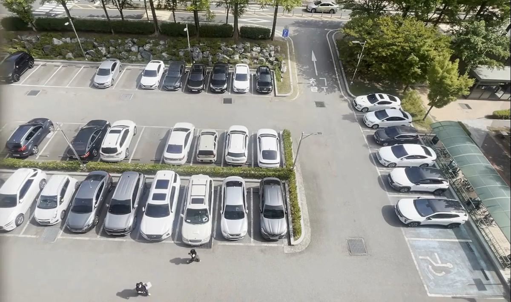
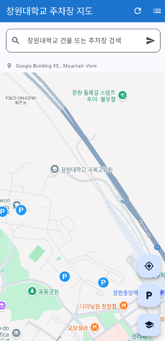
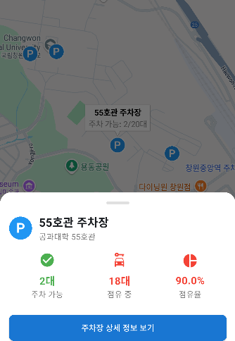
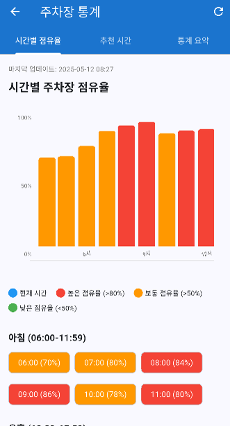
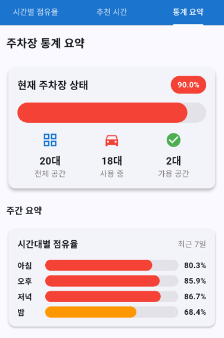
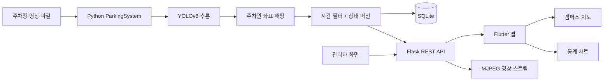
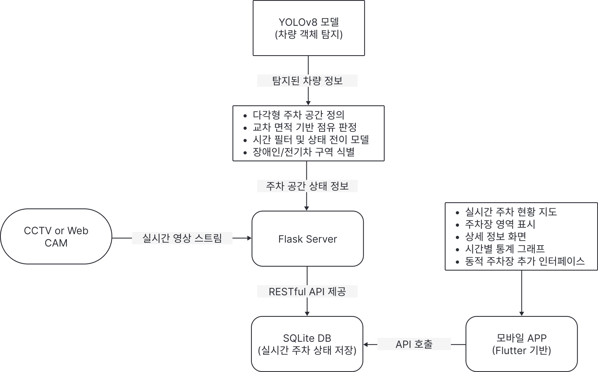

# 빈자리 Binjari

## YOLO 기반 창원대학교 스마트 주차장 모니터링 서비스

빈자리는 주차장 영상을 분석해 주차면별 점유 상태를 보여주는 창원대학교 컴퓨터공학과 캡스톤 디자인 프로젝트입니다. 사용자는 캠퍼스 지도에서 주차장별 빈자리와 점유율을 확인하고, 관리자는 영상 소스·주차면 좌표·시스템 실행 상태를 관리할 수 있습니다.

> 첨부 논문의 설계 내용과 현재 저장소의 구현을 대조해 작성했습니다. 아래 내용은 코드에서 확인 가능한 기능과 실행 방법을 중심으로 정리했습니다.


### 실제 입력 영상



위 이미지는 저장소의 [`videos/library2.mp4`](videos/library2.mp4)에서 추출한 **원본 프레임**입니다. 차량 탐지 박스나 주차면별 점유 판정은 포함하지 않습니다. 추론 결과를 재현하려면 이 영상과 학습된 YOLO 가중치(`models/best.pt` 또는 `MODEL_PATH`)가 모두 필요합니다.

## 프로젝트를 만든 이유

교내 주차는 운전자가 주차 가능 여부를 현장에서 확인해야 하므로 여러 구역을 직접 이동하며 빈자리를 찾게 됩니다. 이 프로젝트는 다음 문제를 해결하는 것을 목표로 합니다.

- 주차 전에는 어느 구역에 빈자리가 있는지 알기 어렵습니다.
- 한 프레임의 오검출만으로 주차 상태가 바뀌면 화면이 불안정해집니다.
- 주차장마다 주차면 배치와 영상 해상도가 달라 고정 규칙만으로 처리하기 어렵습니다.
- 현재 상태뿐 아니라 시간대별 점유율과 입·출차 이력도 필요합니다.

영상 분석 결과를 주차면 단위 상태로 정규화하고, Flutter 앱은 분석 서버의 상태와 통계를 지도·목록·차트로 제공하도록 구성했습니다.

## 주요 기능

### 사용자 앱

- Google Maps 기반 캠퍼스 지도와 주차장 위치 표시
- 주차장별 전체 공간, 빈자리, 점유율, 마지막 갱신 시각 확인
- 주차면 단위 빈자리/점유 상태 시각화
- 시간대별 점유율, 추천 시간, 통계 요약 조회
- 네트워크 오류·서버 중단·데이터 오류를 구분한 재시도 화면
- Flutter 기반 Android, iOS, Web, Windows 대응

### 관리자 앱

- 분석 서버 상태 조회 및 모니터링 시작/중지
- 관리자 토큰 기반 보호 API 호출
- 주차장 추가·수정·삭제
- 영상 소스와 주차면 다각형 좌표 설정
- 서버 주소 변경 및 `SharedPreferences` 저장

### 분석 서버

- Ultralytics YOLOv8 커스텀 모델의 `space-empty`/`space-occupied` 결과 처리
- 영상별 독립적인 주차장 모니터링
- MJPEG 스트림과 REST API 제공
- SQLite에 현재 상태, 차량 입·출차, 시간별 점유율 저장
- 모델·영상·DB 경로의 환경 변수 주입
- 입력 영상이 없을 때 테스트 영상을 생성하는 fallback 제공

## 앱 시연 화면

아래 이미지는 첨부된 학사논문에서 추출한 **프로젝트 시연 당시 화면**입니다. 화면에 표시된 2/20, 90.0% 등의 값은 당시 데모 데이터이며 현재 실시간 주차 현황을 뜻하지 않습니다.

| 캠퍼스 지도 | 주차장 선택 |
| --- | --- |
|  |  |
| 캠퍼스에서 주차장 위치를 탐색합니다. | 마커를 선택하면 해당 주차장의 가용 면수와 점유율을 확인하고 상세 화면으로 이동합니다. |

| 주차장 상세 | 주차면별 상태 |
| --- | --- |
|  |  |
| 전체·사용 중·주차 가능 면수를 요약합니다. | 미리 정의한 주차면을 점유·빈자리·장애인 전용 색상으로 구분합니다. |

| 시간대별 점유율 | 통계 요약 |
| --- | --- |
|  |  |
| 저장된 점유율 기록을 시간대별 그래프로 보여줍니다. | 현재 상태와 최근 기간의 점유율을 함께 비교합니다. |

## 시스템 구조





논문의 아키텍처 그림은 영상 입력 → Flask 분석 → SQLite 저장 → Flutter 앱 조회라는 역할 분리를 보여줍니다. 그림의 CCTV·웹캠은 설계상 입력 예시이며, **현재 저장소에서 바로 실행 가능한 입력은 영상 파일**입니다. 위 Mermaid 도식은 현재 코드의 주차면 매핑·시간 필터·MJPEG API를 추가로 반영했습니다.

| 영역 | 파일 | 책임 |
| --- | --- | --- |
| Flask 서버 | `app_v1.py` | 영상 처리, 추론, 상태 계산, DB, REST API |
| 일괄 탐지 | `detect.py` | 입력 영상에 탐지 결과를 그려 파일로 저장 |
| Flutter 진입점 | `lib/main.dart` | 앱 초기화 및 화면 라우팅 |
| API 클라이언트 | `lib/services/parking_service.dart` | 상태·통계·관리 API 통신 |
| 앱 설정 | `lib/config/app_config.dart` | API 주소, 주차장 메타데이터, 지도 설정 |
| 사용자 화면 | `lib/screens/home_screen.dart`, `campus_map_screen.dart` | 현황과 지도 |
| 관리자 화면 | `lib/screens/admin_screen.dart`, `parking_lots_admin_screen.dart` | 운영 제어와 설정 |
| 통계 화면 | `lib/screens/statistics_screen.dart` | 시간대별 점유율 및 요약 |

## 핵심 알고리즘

### 주차면과 탐지 결과 매핑

모델 바운딩 박스와 관리자가 설정한 주차면 좌표를 비교합니다.

```text
overlap_ratio = intersection_area / parking_space_area
occupied_score = overlap_ratio × detection_confidence
```

일정 비율 이상 겹치는 탐지 결과만 후보로 사용하고, 주차면별 점유/빈 상태 점수를 비교합니다. 영상 전체를 다시 분류하는 대신 주차면 영역에 결과를 귀속시키는 방식입니다.

### 시간적 필터링과 상태 전이

차량·그림자·압축 노이즈로 한두 프레임의 결과가 흔들릴 수 있기 때문에 주차면별 최근 결과를 저장하고 감쇠 가중 평균을 계산합니다. 이후 `empty → occupied`, `occupied → empty` 방향별 연속 프레임 조건과 신뢰도 임계값을 적용해 상태를 확정합니다.

일반 주차면의 필터는 최근 **10개 판정**, 점유 임계값 **0.7**, 과거 신뢰도 감쇠율 **0.9**를 사용합니다. 필터 결과가 신뢰도 **0.7** 이상으로 연속 **5회** 점유이면 `empty → occupied`, 연속 **8회** 빈자리이면 `occupied → empty`로 전환합니다. 이는 원본 영상의 5/8프레임이 아니라 **추론·판정을 수행한 프레임 기준**입니다. 55호관 B1 주차면은 가림과 시야 특성에 맞춰 별도 필터·전환 기준을 적용합니다.

빈자리를 잘못 안내하는 오류가 더 불편하다고 보고, 점유 해제 방향에 더 긴 확인 구간을 뒀습니다. 이 선택은 순간적인 오탐을 줄이는 대신 실제 출차 직후 반영을 늦출 수 있습니다.

### 처리량과 최신성의 균형

기본 설정은 5개 프레임 중 1개만 추론합니다(`--frame-skip 5`). 영상 디코딩 등 나머지 처리는 계속 수행하므로 **추론 대상 프레임 수가 약 80% 감소**하는 것이지 전체 연산량이나 처리 시간이 80% 감소한다는 뜻은 아닙니다. 추론 간격이 길어지면 변화 감지는 늦어질 수 있어 응답성과 안정성 사이의 균형을 조정해야 합니다.

## 기술 스택과 선택 근거

| 기술 | 선택 이유 |
| --- | --- |
| Flutter / Dart | 하나의 코드베이스로 모바일·웹·데스크톱 클라이언트를 구성하고 지도·차트·관리 UI를 일관되게 제공하기 위해 사용했습니다. |
| Python / Flask | OpenCV, Pillow, Ultralytics와 결합하기 쉽고 분석 기능을 REST API로 분리하기 적합합니다. |
| YOLOv8 / PyTorch | 영상 프레임을 빠르게 추론하고 프로젝트 데이터에 맞춘 커스텀 모델을 사용할 수 있습니다. |
| OpenCV | 영상 읽기, 프레임 처리, 오버레이, 스트림 생성에 사용했습니다. |
| SQLite | 단일 분석 서버에서 현재 상태와 이력을 저장하면서 별도 DB 서버 운영 부담을 줄였습니다. |
| REST + CORS | Flutter 클라이언트와 분석 서버를 독립적으로 실행하고 서로 다른 호스트에서도 통신하기 위해 사용했습니다. |
| Google Maps | 주차장 위치와 선택 상태를 실제 캠퍼스 공간 관계로 보여주기 위해 사용했습니다. API 키는 저장소에 넣지 않습니다. |

## 담당 역할 및 주요 기여

모진성은 팀 프로젝트에서 **Flask 백엔드, 영상 추론 주기 최적화, 주차 상태 판정, SQLite 저장·통계 처리**를 담당했습니다. 현재 코드에 기본 정의된 영상 분석 대상은 55호관 20면과 도서관 36면, 총 **56면**입니다. 프로젝트 당시 소개 자료의 57면과 차이가 있어 이 README에는 현재 코드에서 확인되는 수를 적었습니다. 실행 중 DB에 저장된 좌표를 불러오면 실제 면수는 달라질 수 있습니다.

| 담당 영역 | 구현 내용 | 코드 근거 |
| --- | --- | --- |
| 영상 처리·API | 영상 파일을 읽어 YOLOv8 추론 결과를 주차면별 상태로 변환하고 Flask API로 제공합니다. | [`_process_video_file`, `_detect_vehicles`](app_v1.py#L634-L1083) |
| 공간 매핑 | 주차면 다각형과 탐지 박스의 교차 면적, 탐지 신뢰도로 점유 점수를 계산합니다. | [`PARKING_SPACES`](app_v1.py#L250-L310) · [`_detect_vehicles`](app_v1.py#L912-L982) |
| 상태 판정 | 시간 가중 필터와 비대칭 상태 전이 조건을 결합하고 B1 주차면에 별도 보정 규칙을 적용합니다. | [`TemporalFilter`, `ParkingSpaceStateMachine`](app_v1.py#L1225-L1405) |
| 저장·통계 | 주차면 상태·점유율 기록을 SQLite에 저장하고 시간대별 점유율을 집계합니다. | [`build_statistics`](app_v1.py#L1602-L1689) |

현재 저장소에서 확인되는 입력은 **영상 파일**입니다. CCTV·웹캠은 논문 아키텍처의 확장 입력 방식이며, 이 코드의 실시간 카메라 연동 사례로 설명하지 않습니다.

## 개발 과정의 문제와 해결

### TS-01. 매 프레임 추론으로 주차 정보 반영이 늦어짐

초기에는 모든 입력 프레임에서 객체 탐지를 실행해 결과 반영까지 약 10초가 걸렸습니다. 차량 점유 상태가 인접한 프레임마다 바뀌지는 않는다는 점에 착안해, 프레임 카운터가 5의 배수일 때만 YOLO를 호출하도록 변경했습니다. 그 외 프레임은 모델 추론을 건너뛰며, 주차면 상태 계산은 추론이 실행된 프레임의 결과를 사용합니다. [프레임 스킵 구현](app_v1.py#L695-L704)

| 비교 항목 | 변경 전 | 변경 후 |
| --- | --- | --- |
| 추론 주기 | 매 프레임 | 5프레임당 1회 |
| 추론 대상 프레임 수 | 100% 기준 | 약 20% |
| 결과 반영 시간 | 약 10초 | 3초 이내 |

시간 수치는 **프로젝트 당시 측정 결과**이며, 현재 저장소에는 동일 환경에서 재현할 벤치마크 로그와 모델 가중치가 없습니다. 따라서 코드에서 직접 확인되는 효과는 추론 대상 프레임 수의 약 80% 감소입니다. 총 연산량이나 처리 시간의 감소율로 환산하지 않았습니다.

### TS-02. 순간적인 탐지 누락으로 빈자리를 잘못 안내함

단일 프레임만으로 상태를 확정하면 가림이나 낮은 탐지 신뢰도 때문에 주차된 면이 잠시 빈자리로 바뀔 수 있었습니다. 주차면별 최근 10개 결과에 **탐지 신뢰도와 시간 감쇠 가중치**를 적용하고, 필터 결과를 상태 머신에 전달했습니다. 일반 주차면은 신뢰도 0.7 이상인 판정이 점유 방향으로 5회, 빈자리 방향으로 8회 연속될 때 전환합니다. 55호관 B1은 시야 특성 때문에 별도 임계값과 추가 빈자리 확인 조건을 사용합니다. [필터·상태 머신](app_v1.py#L1225-L1405) · [B1 예외 처리](app_v1.py#L990-L1050)

이 설계는 **주차된 공간을 빈자리로 안내하는 오류**를 더 신중하게 다루기 위한 것입니다. 다만 저장소에는 상태 전이 전후의 오탐률 비교 결과가 없어 정확도 개선 수치를 주장하지 않습니다.

### TS-03. 현재 빈자리만으로는 방문 시간 판단이 어려움

5분 간격 점유율 기록을 SQLite에 저장하고 24개 시간 구간으로 집계했습니다. 현재 시간에 실시간 분석 데이터가 있으면 이를 사용하고, 그 외에는 **당일 평균 → 최근 7일 평균** 순으로 값을 채웁니다. 향후 12시간 가운데 **기록이 존재하는 시간대**의 점유율을 비교해 가장 낮은 시간대를 안내합니다. [통계·추천 구현](app_v1.py#L1602-L1689)

현재 브랜치의 구현은 기록이 없는 시간대를 `has_data=false`로 표시하고 추천 후보에서 제외합니다. 후보가 없으면 추천값은 `null`입니다. 이전 `main` 코드에는 모의 혼잡 패턴을 채우는 로직이 있었지만, **현재 구현을 순수 AI 예측이나 데이터가 없는 시간대까지 예측하는 기능으로 소개하지 않습니다.**

## 성과와 검증 범위

- 현재 코드에 기본 정의된 2개 주차장 **56개 주차면** 모니터링 구성. 당시 프로젝트 자료의 57면과는 차이가 있습니다.
- 5프레임당 1회 추론으로 **추론 대상 프레임 수 약 80% 감소**. 당시 측정한 결과 반영 시간은 약 10초에서 3초 이내로 단축됐으나 재현 로그는 저장소에 없습니다.
- 최근 10개 결과의 시간 가중 필터와 **5회/8회 비대칭 상태 전이**로 순간 판정 오류를 완화하도록 설계했습니다. 정량 오탐률은 측정 자료가 없어 기재하지 않았습니다.
- SQLite 기록을 통한 24시간 점유율 조회와 향후 12시간 내 **관측 데이터 기반** 방문 시간 추천을 구현했습니다.
- 교내 소프트웨어 전시회 **인기상** 수상(프로젝트 당시 성과, 증빙 링크는 현재 저장소에 없음).

## API 개요

| Method | Endpoint | 설명 |
| --- | --- | --- |
| `GET` | `/api/health` | 서버 생존 확인 |
| `GET` | `/api/status` | 시스템 실행 상태와 주차면 현황 |
| `GET` | `/api/statistics/<parking_lot_id>` | 주차장별 통계 |
| `GET` | `/api/history` | 점유·입출차 이력 |
| `GET` | `/api/stream/<parking_lot>` | 주차장별 MJPEG 스트림 |
| `POST` | `/api/start` | 분석 시작, 관리자 토큰 필요 |
| `POST` | `/api/stop` | 분석 중지, 관리자 토큰 필요 |
| `GET/POST/PUT/DELETE` | `/api/parking_lots...` | 주차장 및 좌표 관리, 관리자 토큰 필요 |

관리자 요청은 `X-Admin-Token` 헤더를 사용합니다. 토큰은 앱에 하드코딩하지 않고 관리자 화면에서 입력하며 서버는 `ADMIN_TOKEN` 환경 변수로 받습니다.

## 실행 방법

### 분석 서버

Python 3.9 이상을 권장합니다.

```bash
python -m venv .venv
source .venv/bin/activate       # Windows: .venv\\Scripts\\activate
pip install -r requirements.txt

export MODEL_PATH="$PWD/models/best.pt"
export ADMIN_TOKEN="change-me"
python app_v1.py --no-video
```

영상 창을 확인하려면 `--no-video`를 제거합니다. 기본 포트는 `5000`이며 `--port 5000`으로 변경할 수 있습니다.

지원 환경 변수:

```text
MODEL_PATH       YOLO 가중치 경로
VIDEO_PATH_A     55호관 주차장 영상 경로
VIDEO_PATH_B     도서관 주차장 영상 경로
VIDEOS_DIR       영상 디렉터리
DB_PATH          SQLite 파일 경로
ADMIN_TOKEN      관리자 API 토큰
FONT_PATH        한글 오버레이용 폰트 경로
```

현재 저장소에는 도서관 영상 `videos/library2.mp4`가 포함되어 있습니다. 55호관 영상은 `videos/parking_best.mp4` 또는 `VIDEO_PATH_A`로 지정할 수 있습니다. 모델 가중치는 저장소에 없으므로 별도로 준비해야 실제 추론을 실행할 수 있습니다.

### Flutter 앱

```bash
flutter pub get
flutter run --dart-define=API_BASE_URL=http://<서버 IP>:5000
```

Google Maps 키 설정:

- Android: `android/local.properties`에 `MAPS_API_KEY=...`
- iOS: `ios/Flutter/Secrets.xcconfig`에 `MAPS_API_KEY=...`

서버 주소는 `--dart-define`으로 주입하거나 관리자 설정에서 변경할 수 있습니다. Android 에뮬레이터에서 호스트 PC 서버를 호출할 때는 보통 `localhost` 대신 `10.0.2.2`를 사용합니다.

### 단독 영상 탐지 결과 생성

```bash
python detect.py \
  --model models/best.pt \
  --video videos/library2.mp4 \
  --output detect_result.mp4
```

## 실행 시 문제 해결

### 모델을 찾을 수 없음

`models/best.pt`를 확인하거나 `MODEL_PATH`를 지정합니다. 서버는 여러 후보 경로를 순서대로 탐색하고 모델이 없으면 로그에 원인을 남깁니다. 가중치 파일은 Git에 커밋하지 않는 것을 권장합니다.

### 영상이 없어 서버가 시작되지 않음

`VIDEO_PATH_A`, `VIDEO_PATH_B`, `VIDEOS_DIR` 설정과 파일 확장자를 확인합니다. 입력 파일이 없을 때 테스트 컬러 영상을 만드는 fallback이 있어 API·앱 연동을 먼저 검증할 수 있습니다. 실제 점유 분석은 실제 영상과 모델로 검증해야 합니다.

### 점유 상태가 프레임마다 바뀜

단일 프레임 결과를 확정 상태로 사용하면 오검출이 즉시 노출됩니다. 이 프로젝트는 주차면별 시간 필터와 상태 머신을 함께 사용합니다. 환경에 맞춰 `history_length`, `occupancy_threshold`, 전환 연속 프레임 수를 조정하되 정확도와 반응성의 트레이드오프를 확인해야 합니다.

### 점유율이 이상하게 계산됨

1. 영상 해상도와 주차면 좌표가 같은 기준인지 확인합니다.
2. 주차면 ID가 주차장별로 중복되지 않는지 확인합니다. DB 기본키는 `(parking_lot, id)` 조합입니다.
3. 탐지 박스와 주차면의 겹침 비율 및 신뢰도를 로그에서 확인합니다.
4. 이전 SQLite 파일을 사용하는 경우 스키마 마이그레이션 로그와 `DB_PATH`를 확인합니다.

### Flutter 앱이 서버에 연결되지 않음

- 서버에서 `GET /api/health`가 응답하는지 확인합니다.
- 실제 기기에서는 `localhost`가 기기 자신을 의미하므로 개발 PC의 LAN IP를 사용합니다.
- Android 에뮬레이터는 `10.0.2.2`, iOS 시뮬레이터는 `localhost` 또는 `127.0.0.1`을 환경에 맞게 사용합니다.
- 방화벽, 포트 `5000`, `API_BASE_URL`, 네트워크 권한을 확인합니다.

### 관리자 기능이 거부됨

서버의 `ADMIN_TOKEN`과 앱에서 입력한 토큰이 같은지 확인하고 요청 헤더 `X-Admin-Token`이 포함되는지 확인합니다. 관리자 토큰을 소스 코드나 README에 실제 값으로 기록하지 않습니다.

## 현재 범위와 한계

- 도서관 영상은 저장소에 있지만 모델 가중치는 없습니다. 따라서 이 저장소만으로는 YOLO 인식 결과를 재현할 수 없습니다.
- 현재 구현은 영상 파일 기반 운영 시나리오를 중심으로 하며, 실시간 CCTV 연동은 입력 소스를 교체하는 확장 과제입니다.
- SQLite는 단일 서버·프로토타입 운영에 적합합니다. 다중 분석 서버나 대규모 동시 접속에서는 PostgreSQL, 메시지 큐, 스트림 처리 계층을 검토해야 합니다.
- 재현 가능한 평가 데이터셋과 실험 로그가 추가되기 전에는 탐지 정확도 수치를 제시하지 않습니다.

## 라이선스 및 크레딧

창원대학교 컴퓨터공학과 캡스톤 디자인 프로젝트  ·  모진성 · 안서현
