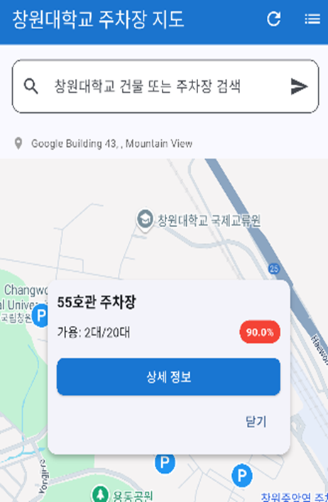
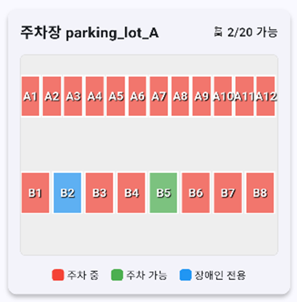
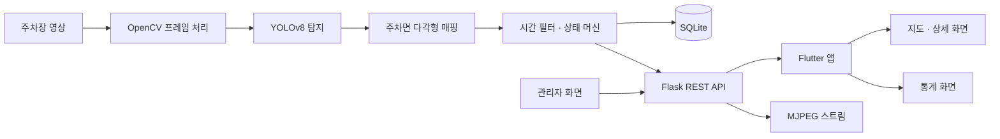

# BINJARI | 빈자리

주차장 영상에서 주차면별 점유 상태를 분석하고, 운전자에게 빈자리와 시간대별 혼잡도를 보여주는 스마트 주차장 모니터링 서비스입니다. 창원대학교 컴퓨터공학과 캡스톤 디자인 프로젝트로, 55호관과 도서관 주차장 **2곳의 주차면 56개**를 대상으로 구현했습니다.


## 주요 기능과 실행 화면

- **주차 현황:** 캠퍼스 지도에서 주차장을 선택하고 전체·점유·빈 주차면 수를 확인합니다.
- **주차면별 상태:** 영상 분석 결과를 주차면 다각형에 연결해 점유·빈자리 상태를 표시합니다.
- **시간대별 통계:** 저장된 점유율을 24개 시간 구간으로 집계하고, 기록이 있는 향후 12시간 중 상대적으로 여유로운 시간을 안내합니다.
- **운영 관리:** 관리자 화면에서 영상 소스, 주차면 좌표, 분석 서버 실행 상태를 관리합니다.

| 캠퍼스 지도 | 주차장 선택 |
| --- | --- |
|  |  |
| 주차장 위치를 탐색합니다. | 빈자리 수와 점유율을 확인합니다. |

| 주차장 상세 | 주차면별 상태 |
| --- | --- |
|  |  |
| 전체·사용 중·주차 가능 면수를 확인합니다. | 각 주차면의 상태를 색상으로 구분합니다. |

| 시간대별 점유율 | 통계 요약 |
| --- | --- |
|  |  |
| 시간대별 점유율을 그래프로 살펴봅니다. | 현재 상태와 최근 기록을 함께 확인합니다. |

## 시스템 아키텍처




분석 서버는 영상 입력·추론·주차면 판정·기록 저장을 맡고, Flutter 앱은 API를 통해 현황과 통계를 조회합니다. 영상 파일로 실행할 수 있으며, 주차면 좌표와 영상 소스는 관리자 기능에서 설정합니다.

## 기술 스택과 선택 이유

<table>
  <tr>
    <td width="33%" valign="top"><br><strong>운전자·관리자 앱</strong><br>지도, 주차 현황, 통계, 관리 화면을 하나의 코드베이스로 구성했습니다. Android·iOS·Web 화면을 같은 데이터 모델과 API로 연결할 수 있습니다.</td>
    <td width="33%" valign="top"><br><strong>분석 API</strong><br>Python 영상 처리 로직을 앱과 분리하고, 주차 상태·통계·관리 기능을 REST API로 제공하기 위해 사용했습니다.</td>
    <td width="33%" valign="top"><br><strong>주차면 탐지</strong><br>프로젝트 데이터로 학습한 <code>space-empty</code>·<code>space-occupied</code> 모델 결과를 프레임별 주차 상태 판정에 사용합니다.</td>
  </tr>
  <tr>
    <td valign="top"><br><strong>영상·공간 처리</strong><br>영상 프레임을 읽고, 탐지 박스와 주차면 다각형의 마스크 교차 영역을 계산하는 데 사용했습니다.</td>
    <td valign="top"><br><strong>상태·이력 저장</strong><br>단일 분석 서버에서 주차면 상태, 입·출차 이력, 점유율 샘플을 별도 DB 서버 없이 관리합니다.</td>
    <td valign="top"><br><strong>위치 중심 탐색</strong><br>사용자가 캠퍼스 지도에서 주차장 위치와 현황을 함께 파악하도록 구성했습니다. 점유율 그래프에는 <code>fl_chart</code>를 사용합니다.</td>
  </tr>
</table>

## 담당 역할 및 핵심 구현

모진성은 **Flask 백엔드, 영상 추론 주기 최적화, 주차 상태 판정, SQLite 저장·통계 처리**를 담당했습니다. Flutter 사용자·관리자 화면을 포함한 서비스 전체는 팀의 결과물입니다.

| 구현 | 접근 방식 | 코드 |
| --- | --- | --- |
| 영상 처리·상태 API | 주차장별 영상 프레임을 처리하고 추론 결과를 주차면 상태로 변환 | [`ParkingSystem`](app_v1.py#L490-L715), [`_detect_vehicles`](app_v1.py#L854-L1083) |
| 공간 매핑 | 주차면 다각형과 탐지 박스의 교차 면적을 구해 `겹침 비율 × 탐지 신뢰도`로 점수화 | [`_calculate_mappings`](app_v1.py#L1132-L1155) |
| 상태 안정화 | 최근 결과의 시간 가중 평균과 점유/빈자리 방향별 전환 기준 결합 | [`TemporalFilter`, `ParkingSpaceStateMachine`](app_v1.py#L1225-L1405) |
| 통계·추천 | 점유율 샘플을 시간대별로 집계하고 관측 데이터가 있는 시간대만 추천 후보로 사용 | [`build_statistics`](app_v1.py#L1602-L1689) |

## Troubleshooting

### 1. 모든 프레임을 추론해 주차 정보 반영이 늦어짐

**문제·원인:** 초기 구조는 입력되는 모든 프레임에 YOLO 추론을 수행했습니다. 연속 프레임 사이에 차량 점유 상태가 매번 바뀌지는 않는데도 모델 실행을 반복해 새 상태가 화면에 반영되기까지 약 10초가 걸렸습니다.

**해결:** 프레임 카운터를 두고 **5프레임당 1회**만 추론하도록 변경했습니다. 추론하지 않는 프레임은 모델 실행을 건너뛰고, 상태 판정은 추론이 실행된 프레임에서만 갱신합니다. [프레임 스킵 코드](app_v1.py#L695-L704)

| 항목 | 변경 전 | 변경 후 |
| --- | --- | --- |
| 추론 주기 | 매 프레임 | 5프레임당 1회 |
| 추론 대상 프레임 수 | 100% | 약 20% |
| 결과 반영 시간 | 약 10초 | 3초 이내 |

결과 반영 시간은 **프로젝트 당시 측정값**입니다. 코드에서 직접 확인할 수 있는 변화는 추론 대상 프레임 수 약 80% 감소이며, 영상 디코딩 등을 포함한 전체 연산량이 80% 줄었다는 뜻은 아닙니다.

### 2. 한 프레임의 탐지 누락이 빈자리 안내로 이어짐

**문제·원인:** 차량이 가려지거나 탐지 신뢰도가 일시적으로 낮아질 때 단일 프레임 결과로 상태를 바꾸면, 주차된 면을 빈자리로 잘못 안내할 수 있습니다.

**해결:** 일반 주차면은 최근 **10개 판정**에 탐지 신뢰도와 시간 감쇠 가중치(`0.9`)를 적용합니다. 점유 임계값 `0.7`로 필터 결과를 구분한 뒤 상태 머신에 전달하고, 점유 방향은 **5회**, 빈자리 방향은 **8회**의 확인 기준을 사용합니다. 반대 판정이 나오면 해당 방향의 카운터를 초기화하고, 신뢰도 `0.7` 미만이면 카운터를 갱신하지 않습니다. 이 횟수는 원본 영상이 아닌 **추론을 수행한 프레임 기준**입니다. [시간 필터·상태 머신](app_v1.py#L1225-L1405)

카메라 가장자리에 걸리는 55호관 B1은 별도 필터와 더 엄격한 빈자리 확인 조건을 적용했습니다. 빈자리를 잘못 안내하는 오류를 줄이는 대신, 실제 출차 직후의 반영은 늦어질 수 있습니다. [B1 예외 처리](app_v1.py#L990-L1060)

### 3. 현재 빈자리 수만으로는 방문 시간을 고르기 어려움

**문제:** 현재 상태는 알려줄 수 있지만, 방문 예정 시간의 혼잡도를 비교할 근거가 부족했습니다.

**해결:** 점유율을 **5분 간격**으로 SQLite에 저장하고 24개 시간 구간으로 집계했습니다. 현재 시간은 실시간 분석값을, 나머지 시간은 **당일 평균 → 최근 7일 평균** 순으로 사용합니다. 향후 12시간 중 기록이 있는 시간대에서 점유율이 가장 낮은 시간을 추천합니다. 기록이 없으면 `has_data=false`로 표시하고 추천에서 제외합니다. 이는 별도의 AI 예측 모델이 아닌 **관측 기록 기반 비교**입니다. [점유율 기록](app_v1.py#L1074-L1082) · [집계·추천](app_v1.py#L1602-L1689)

### 4. 여러 주차장에서 같은 주차면 ID가 충돌함

**문제·원인:** 55호관과 도서관 모두 `A1`, `B1` 같은 주차면 ID를 사용합니다. 초기 스키마처럼 ID만 기본키로 사용하면 서로 다른 주차장의 상태를 구분할 수 없습니다.

**해결:** 현재 상태 테이블의 기본키를 **`(parking_lot, id)`**로 구성하고, 상태 조회·입출차 이력 갱신에도 두 값을 함께 사용합니다. 기존 스키마로 생성된 상태 캐시는 초기화 시 새 스키마로 재생성합니다. [DB 스키마](app_v1.py#L335-L374) · [상태·이력 갱신](app_v1.py#L1172-L1217)

## 결과

- 2개 주차장, **56개 주차면**을 대상으로 상태 조회 구조 구현
- 5프레임당 1회 추론으로 **추론 대상 프레임 수 약 80% 감소**, 프로젝트 측정 기준 결과 반영 시간 약 10초 → 3초 이내
- 시간 가중 필터와 비대칭 상태 전이 기준으로 순간적인 탐지 누락이 곧바로 빈자리 안내에 반영되지 않도록 설계
- SQLite 기록을 활용한 시간대별 점유율 조회와 방문 시간 추천 구현
- 교내 소프트웨어 전시회 **인기상** 수상

## 실행 방법

### 분석 서버

```bash
python -m venv .venv
source .venv/bin/activate
pip install -r requirements.txt

export MODEL_PATH="$PWD/models/best.pt"
export ADMIN_TOKEN="change-me"
python app_v1.py --no-video
```

기본 포트는 `5000`입니다. 저장소에 도서관 입력 영상 [`videos/library2.mp4`](videos/library2.mp4)는 있지만, **학습된 모델 가중치는 포함되어 있지 않습니다.** 실제 추론에는 `models/best.pt` 또는 `MODEL_PATH`로 지정한 가중치가 필요합니다. 영상 경로는 `VIDEO_PATH_A`, `VIDEO_PATH_B`로 지정할 수 있습니다.

### Flutter 앱

```bash
flutter pub get
flutter run --dart-define=API_BASE_URL=http://<서버 IP>:5000
```

Google Maps API 키는 Android에서 `android/local.properties`의 `MAPS_API_KEY`, iOS에서 `ios/Flutter/Secrets.xcconfig`의 `MAPS_API_KEY`로 설정합니다. 실제 기기에서 서버에 연결할 때는 `localhost` 대신 서버의 LAN IP를 사용합니다.

## 프로젝트 정보

창원대학교 컴퓨터공학과 캡스톤 디자인 · 모진성 · 안서현
